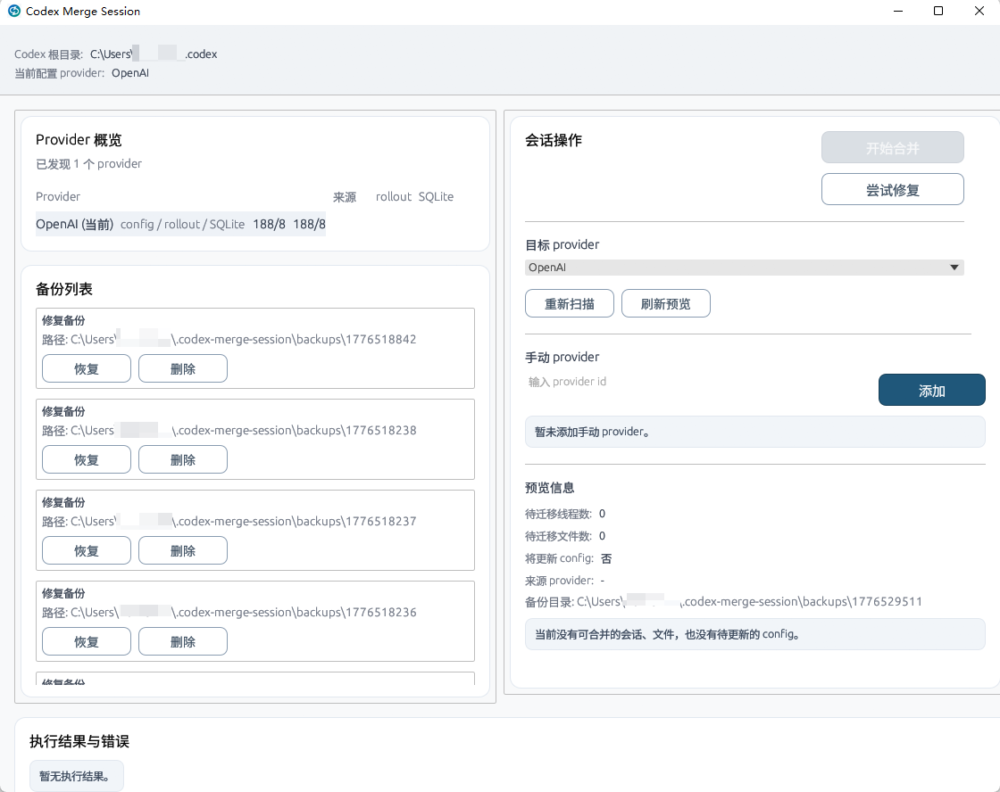

# Codex Merge Session

`Codex Merge Session` 是一个基于 Rust + egui 的本地桌面工具，用来把散落在不同 provider 下的 Codex 会话重新归并到同一个目标 provider，并补做一轮数据修复，让历史会话重新可见、路径信息恢复正常。

当前实现主要面向 Windows 上的 Codex 本地数据目录，默认读取用户目录下的 `.codex`。



## 核心能力

### 1. 合并多个 provider

- 扫描 `config.toml`
- 扫描 `sessions/` 和 `archived_sessions/` 下的 rollout 文件
- 单独扫描 `state_5.sqlite`
- 汇总 provider 来源：`config / rollout / SQLite / manual`
- 预览本次会迁移的线程、会话文件和配置变化
- 执行合并时同时更新：
  - `state_5.sqlite` 中的 `threads.model_provider`
  - rollout 首行 `session_meta.payload.model_provider`
  - 根级 `config.toml` 中当前 `model_provider`

### 2. 修复 Codex 历史数据

- 规范化 SQLite 中线程的 `cwd`
- 清理 rollout 文件中的 Windows 扩展路径前缀 `\\?\`
- 重建 `session_index.jsonl`
- 修复 `.codex-global-state.json` 中的路径残留
- 补回 workspace roots 和 `thread-workspace-root-hints`

### 3. 备份、恢复、删除

- 每次执行合并或修复前自动创建备份
- 支持在 UI 中查看备份列表
- 支持恢复备份
- 支持删除备份

### 4. 手动补充 provider

- 支持手动添加 provider
- 手动 provider 会参与 provider 汇总和目标 provider 下拉列表
- 手动 provider 会持久化到应用自己的 settings 文件中

## 适用场景

- 你切换过多个 provider，导致旧会话在当前 provider 下不可见
- SQLite、rollout、config 三处 provider 信息不一致
- Windows 路径里混入了 `\\?\` 前缀，导致 workspace 或会话索引异常
- `.codex-global-state.json` 丢失了 workspace roots 或线程与项目的映射
- 你希望在真正执行前先看一眼本次会动到哪些会话和文件

## 会读写哪些数据

默认会读取用户目录下的 Codex 根目录：

- `%USERPROFILE%\\.codex`
- 或 `$HOME/.codex`

执行过程中可能会读写这些文件：

- `.codex/config.toml`
- `.codex/state_5.sqlite`
- `.codex/session_index.jsonl`
- `.codex/.codex-global-state.json`
- `.codex/sessions/**/rollout-*.jsonl`
- `.codex/archived_sessions/**/rollout-*.jsonl`

应用自己的附加数据位于 `.codex` 的同级目录：

- `.codex-merge-session/backups`
- `.codex-merge-session/settings.json`

## 使用方式

### 合并 provider

1. 关闭正在运行的 Codex
2. 启动本工具
3. 在右侧选择目标 provider
4. 先看预览信息，确认将迁移的线程数、文件数和配置变更
5. 点击“开始合并”

执行完成后，工具会同步更新 SQLite、rollout 和 `config.toml`，并保留一份可恢复的备份。

### 尝试修复

当会话路径、项目列表、workspace 映射或索引异常时，可以点击“尝试修复”。

修复不会更改目标 provider，但会整理会话路径、重建索引，并修复全局状态文件里的 workspace 信息。

### 恢复备份

在左侧“备份列表”中选择某条备份后点击“恢复”，工具会把备份快照恢复到原始位置。

## 构建与运行

### 开发运行

```bash
cargo run
```

### Release 运行

```bash
cargo run --release
```

### 产物构建

```bash
cargo build --release
```

Windows 下可执行文件位于：

```text
target/release/codex-merge-session.exe
```

## 开发校验

```bash
cargo test
cargo build --release
```

## 技术栈

- Rust 2021
- eframe / egui
- rusqlite
- serde / serde_json
- toml
- sysinfo

## 注意事项

- 执行合并、修复、恢复备份前，建议先关闭 Codex
- 本工具会直接修改本地 Codex 数据目录，建议先确认当前账号和数据目录正确
- 如果你正在验证新逻辑，优先先看预览，再执行真正写入
- 备份删除不可通过本工具直接恢复，删除前请确认

## 项目目标

这个项目的重点不是“导出/导入聊天内容”，而是把 Codex 本地多来源元数据重新整理一致：

- provider 一致
- rollout 与 SQLite 一致
- config 与当前目标 provider 一致
- session index 与实际线程一致
- global state 与真实 workspace 状态一致

如果你的核心诉求是“切换 provider 后把历史会话重新找回来”，这个工具就是为这个场景设计的。
